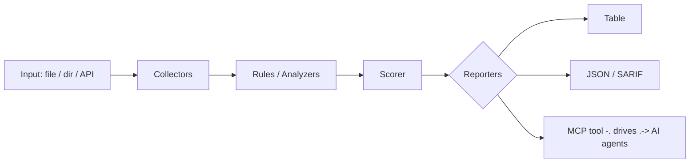

<a name="top"></a>
<div align="center">


# SBOMB

### Generate a CycloneDX SBOM directly from an unpacked firmware root filesystem and flag components with known CVEs and EOL kernels.


[](https://pypi.org/project/cognis-sbomb/) [](https://github.com/cognis-digital/sbomb/actions) [](LICENSE) [](https://github.com/cognis-digital)

*IoT / OT / Embedded — firmware, buses, and device security.*

</div>

```bash
pip install "git+https://github.com/cognis-digital/sbomb.git"
sbomb scan .            # → prioritized findings in seconds
```

<!-- cognis:layman:start -->
## What is this?

sbomb inspects the unpacked file system from a router, smart device, or any embedded Linux gadget and produces a complete list of every software package inside it — the kind of list regulators increasingly require called an SBOM (Software Bill of Materials). It automatically cross-checks each package against a database of known security flaws, highlights the dangerous ones, and saves the results as a standard CycloneDX JSON file your security team or compliance tool can immediately import. It is aimed at firmware engineers, product-security teams, and auditors who need to know exactly what is running inside a device before it ships or after a vulnerability alert comes in.
<!-- cognis:layman:end -->

## Contents

- [Why sbomb?](#why) · [Features](#features) · [Quick start](#quick-start) · [Example](#example) · [Architecture](#architecture) · [AI stack](#ai-stack) · [How it compares](#how-it-compares) · [Integrations](#integrations) · [Install anywhere](#install-anywhere) · [Related](#related) · [Contributing](#contributing)

<a name="why"></a>
## Why sbomb?

Regulatory tailwind (EU CRA / FDA premarket SBOM mandates) — single binary that turns a squashfs into a compliance artifact. Compliance-deadline urgency drives adoption.

`sbomb` is single-purpose, scriptable, and self-hostable: point it at a target, get prioritized results in the format your workflow already speaks (table · JSON · SARIF), gate CI on it, and let agents drive it over MCP.

<div align="right"><a href="#top">↑ back to top</a></div>

<a name="features"></a>
## Features

- ✅ Version Compare
- ✅ Detect Dpkg
- ✅ Detect Opkg
- ✅ Detect Apk
- ✅ Detect Os Release
- ✅ Detect Busybox
- ✅ Detect Python Packages
- ✅ Detect Node Packages
- ✅ Runs on Linux/macOS/Windows · Docker · devcontainer
- ✅ Ports in Python, JavaScript, Go, and Rust (`ports/`)

<div align="right"><a href="#top">↑ back to top</a></div>

<a name="quick-start"></a>
<!-- cognis:install:start -->
## Install

`sbomb` is source-available (not published to PyPI) — every method below installs
straight from GitHub. Pick whichever you prefer; the one-line scripts auto-detect
the best tool available on your machine.

**One-liner (Linux / macOS):**
```sh
curl -fsSL https://raw.githubusercontent.com/cognis-digital/sbomb/HEAD/install.sh | sh
```

**One-liner (Windows PowerShell):**
```powershell
irm https://raw.githubusercontent.com/cognis-digital/sbomb/HEAD/install.ps1 | iex
```

**Or install manually — any one of:**
```sh
pipx install "git+https://github.com/cognis-digital/sbomb.git"     # isolated (recommended)
uv tool install "git+https://github.com/cognis-digital/sbomb.git"  # uv
pip install "git+https://github.com/cognis-digital/sbomb.git"      # pip
```

**From source:**
```sh
git clone https://github.com/cognis-digital/sbomb.git
cd sbomb && pip install .
```

Then run:
```sh
sbomb --help
```
<!-- cognis:install:end -->

## Quick start

```bash
pip install "git+https://github.com/cognis-digital/sbomb.git"
sbomb --version
sbomb scan .                       # scan current project
sbomb scan . --format json         # machine-readable
sbomb scan . --fail-on high        # CI gate (non-zero exit)
```

<div align="right"><a href="#top">↑ back to top</a></div>

<a name="example"></a>
## Example

```text
$ sbomb scan .
  [HIGH    ] SBO-001  example finding             (./src/app.py)
  [MEDIUM  ] SBO-002  another signal              (./config.yaml)

  2 findings · risk score 5 · 38ms
```

<div align="right"><a href="#top">↑ back to top</a></div>

<a name="architecture"></a>
## Architecture



<div align="right"><a href="#top">↑ back to top</a></div>

<a name="ai-stack"></a>
## Use it from any AI stack

`sbomb` is interoperable with every popular way of using AI:

- **MCP server** — `sbomb mcp` (Claude Desktop, Cursor, Cognis.Studio, [uncensored-fleet](https://github.com/cognis-digital/uncensored-fleet))
- **OpenAI-compatible / JSON** — pipe `sbomb scan . --format json` into any agent or LLM
- **LangChain · CrewAI · AutoGen · LlamaIndex** — wrap the CLI/JSON as a tool in one line
- **CI / scripts** — exit codes + SARIF for non-AI pipelines

<div align="right"><a href="#top">↑ back to top</a></div>

<a name="how-it-compares"></a>
## How it compares

| | **Cognis sbomb** | syft + cve-bin-tool |
|---|:---:|:---:|
| Self-hostable, no account | ✅ | varies |
| Single command, zero config | ✅ | ⚠️ |
| JSON + SARIF for CI | ✅ | varies |
| MCP-native (AI agents) | ✅ | ❌ |
| Polyglot ports (JS/Go/Rust) | ✅ | ❌ |
| Open license | ✅ COCL | varies |

*Built in the spirit of **syft + cve-bin-tool**, re-framed the Cognis way. Missing a credit? Open a PR.*

<div align="right"><a href="#top">↑ back to top</a></div>

<a name="integrations"></a>
## Integrations

Pipes into your stack: **SARIF** for code-scanning, **JSON** for anything, an **MCP server** (`sbomb mcp`) for AI agents, and a webhook forwarder for SIEM/Slack/Jira. See [`docs/INTEGRATIONS.md`](docs/INTEGRATIONS.md).

<div align="right"><a href="#top">↑ back to top</a></div>

<a name="install-anywhere"></a>
## Install — every way, every platform

```bash
pip install "git+https://github.com/cognis-digital/sbomb.git"    # pip (works today)
pipx install "git+https://github.com/cognis-digital/sbomb.git"   # isolated CLI
uv tool install "git+https://github.com/cognis-digital/sbomb.git" # uv
pip install cognis-sbomb                                          # PyPI (when published)
docker run --rm ghcr.io/cognis-digital/sbomb:latest --help        # Docker
brew install cognis-digital/tap/sbomb                             # Homebrew tap
curl -fsSL https://raw.githubusercontent.com/cognis-digital/sbomb/main/install.sh | sh
```

| Linux | macOS | Windows | Docker | Cloud |
|---|---|---|---|---|
| `scripts/setup-linux.sh` | `scripts/setup-macos.sh` | `scripts/setup-windows.ps1` | `docker run ghcr.io/cognis-digital/sbomb` | [DEPLOY.md](docs/DEPLOY.md) (AWS/Azure/GCP/k8s) |

<div align="right"><a href="#top">↑ back to top</a></div>

<a name="related"></a>
## Related Cognis tools

- [`fwxray`](https://github.com/cognis-digital/fwxray) — Diff two firmware images and surface exactly what changed: new binaries, flipped config flags, added certs, and shifted entropy regions.
- [`canzap`](https://github.com/cognis-digital/canzap) — Replay, fuzz, and assert on CAN bus traffic from a .pcap or SocketCAN interface with a tiny YAML DSL.
- [`mqttspy`](https://github.com/cognis-digital/mqttspy) — Passively map an MQTT broker: enumerate topics, detect unauthenticated writes, spot PII/secrets in payloads, and emit a risk report.
- [`uefiscan`](https://github.com/cognis-digital/uefiscan) — Audit UEFI firmware dumps for missing Secure Boot keys, unsigned modules, S3 boot-script vulns, and known SMM threats.
- [`modpot`](https://github.com/cognis-digital/modpot) — Spin up a high-interaction Modbus/DNP3 ICS honeypot that logs attacker register reads/writes as structured JSON.
- [`keyhunt`](https://github.com/cognis-digital/keyhunt) — Scan firmware blobs and filesystem dumps for hardcoded private keys, API tokens, default creds, and weak RSA/ECC material.

**Explore the suite →** [🗂️ all 170+ tools](https://github.com/cognis-digital/cognis-neural-suite) · [⭐ awesome-cognis](https://github.com/cognis-digital/awesome-cognis) · [🔗 cognis-sources](https://github.com/cognis-digital/cognis-sources) · [🤖 uncensored-fleet](https://github.com/cognis-digital/uncensored-fleet) · [🧠 engram](https://github.com/cognis-digital/engram)

<div align="right"><a href="#top">↑ back to top</a></div>

<a name="contributing"></a>
## Contributing

PRs, new rules, and demo scenarios are welcome under the collaboration-pull model — see [CONTRIBUTING.md](CONTRIBUTING.md) and [SECURITY.md](SECURITY.md).

> ### ⭐ If `sbomb` saved you time, **star it** — it genuinely helps others find it.

## License

Source-available under the **Cognis Open Collaboration License (COCL) v1.0** — free for personal, internal-evaluation, research, and educational use; **commercial / production use requires a license** (licensing@cognis.digital). See [LICENSE](LICENSE).

---

<div align="center"><sub><b><a href="https://cognis.digital">Cognis Digital</a></b> · one of 170+ tools in the <a href="https://github.com/cognis-digital/cognis-neural-suite">Cognis Neural Suite</a> · <i>Making Tomorrow Better Today</i></sub></div>
